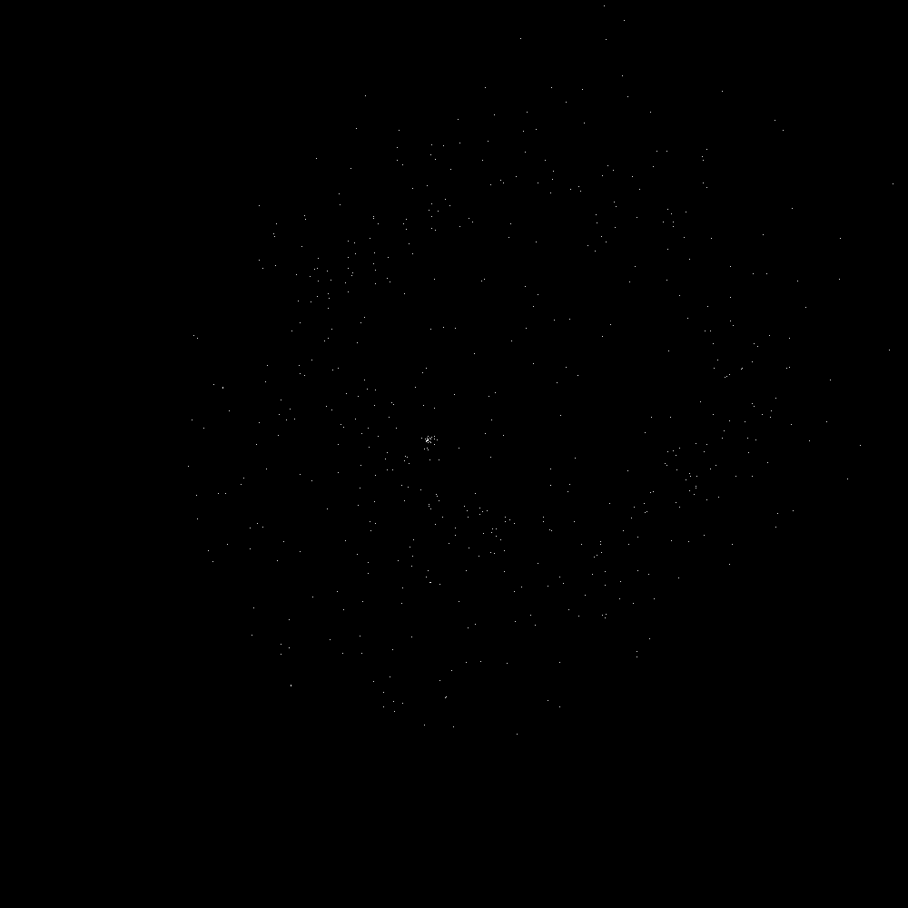
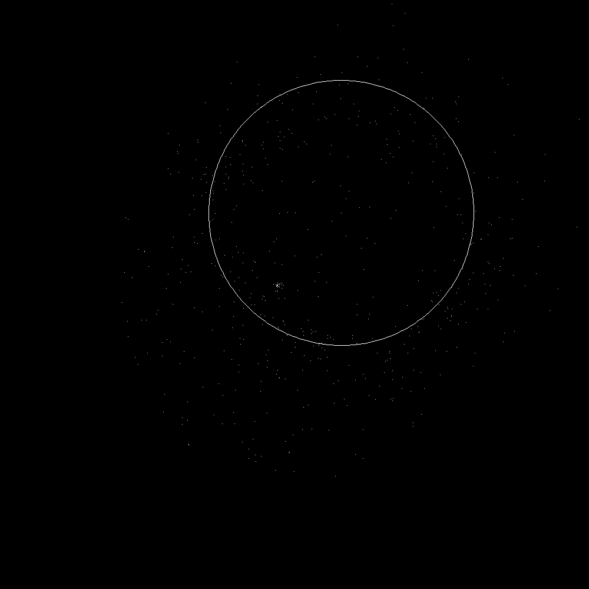

## Code Sample for Jet Propulsion Lab 2020 Summer Internship -
C implementation (with Python helper) of the Fuzzy Hough Transform for X-ray counterpart detection of Black-hole merger-induced gravitational waves

## Context

Thank you for reading/considering my application to be a 2020 JPL Summer Intern! This repository contains an updated and cleaned-up version of some code I've been working on for the past several months as part of a research project with Prof. Frits Paerels of the Columbia Astrophysics Laboratory. The basic idea is simple: we know, as per the findings of LIGO and VIRGO, that black-hole mergers cause gravitational waves. However, to date we have been unable to find any direct electromagnetic counterpart to these gravitational wave events. Which is a shame, because doing so would allow for precise localization of the event's progenitor! As you can imagine, there have been a slew of attempts to find indirect and clever ways to observe electromagnetic counterparts.

One such approach involves using the scattering properties of X-ray light to identify gravitational wave counterparts. When light from a distant X-ray burst or point source enters the galaxy, it undergoes classical Fraunhofer diffraction and scatters off of galactic dust. This scattering causes a characteristic annular/"ring-like" pattern which grows and dissipates on the order of about a day. So if we can identify these annuli in X-ray satellite imaging data shortly after known GW events (and in the same patch of the sky), we can reasonably say we have found an X-ray counterpart to the GW event. More on this approach can be found in this reference paper:
**"Novel Observational Technique of Gravitational Wave (GW) Events: Detecting and Locating Electromagnetic Counterparts to GW Sources using Dust Scattering Halos"
by R. Nederlander and F. Paerels. American Astronomical Society Meeting #231, id. 445.10, 2018.
https://ui.adsabs.harvard.edu/abs/2018AAS...23144510N/abstract**

My contribution to this project is finding computational approaches to the problem, as there are large sets of image data to comb through. Computationally, the question reduces to a simple and classic computer vision problem: detecting circles in noisy image data. My first approaches, which met with moderate success, involved using the popular computer vision libraries scikit-image and OpenCV (both in Python), which had implementations of the classical circle Hough Transform and RANSAC algorithms. However, our data is potentially too sparse and too noisy for these algorithms to work very well. So after extensive literature review, I found the Fuzzy Hough Transform, which is a modification of the classical Hough Transform optimized for noisy data and "fuzzy" circle patterns. See this reference paper for more info:
**"Fuzzy Hough Transform" by J.H. Han, L.T. Koczy, and T. Poston. Proceedings of the Second IEEE International Conference on Fuzzy Systems, 1993.
https://ieeexplore.ieee.org/document/327545**

Because the FHT is not very widely used, I had to create my own ground-up implementation for our use in this project. As such, all of the code written in this repository is my own, although the algorithm is not.


## Usage

My code takes the input of an image of X-ray CCD satellite observation. Note that the running time is O(p^2+n), where p is the number of photons and n is the number of pixels in the observation. So, the code is optimized for observations with on the order ~10^3 photons (the sample has about 300). This works out, as the Swift satellite observations we are using in the actual project are well within this limit.
The code produces a text output of the 3 most likely locations of circles in the image (in our case, these correspond to X-ray scattering halos) for each of the 10 test radii.

To run:
First, run the Python script img_to_normtxt.py to parse the input image and convert each pixel to a text 1 or 0 (photon or no photon, respectively) and store it in normimg.txt ('normalized image', normalized meaning set to 1 or 0). Note that the program outputs to stdout, so make sure to redirect to a file if you don't want a stream of meaningless 1's and 0's on your terminal.
Next, run fuzzyhough.c with normimg.txt (or whatever you named the file) as a command-line argument. This runs my implementation of the Fuzzy Hough Transform and returns text output of the most likely circle locations, along with their scores in the accumulator matrix.
Finally, you can test these outputs by modifying test_annuli.py with the (x,y) and r of the outputted circles. The script will project the circle onto the original image data so you can see if the algorithm guessed correctly or not. It'd make the most sense to test the circles with the highest values in the accumulator matrix.

Here is a sample (Windows) command line session of running this code:
```
>python img_to_normtxt.py > normimg.txt
>gcc fuzzyhough.c
>a.exe normimg.txt
>python test_annuli.py
```

Here are the input (first) and output (second) images of running the code using the given sample image, for which the highest accumulator value is at (579, 361) with a radius of 225:
    


As you can see, it worked well here! The algorithm is designed to find sparse annuli which even the human eye might miss at first glance.

Next steps include applying the algorithm to actual X-ray CCD data from the Swift satellite; and using Poisson statistics to better determine which potential annuli are 'notable', rather than just taking the highest accumulator values.
